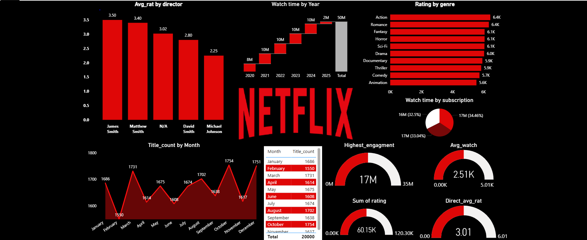

# 🎬 Netflix Data Analysis Dashboard

## 📌 Overview
This project analyzes Netflix data to uncover trends in content, genres, and user preferences.

## 🛠️ Tools Used
- Power BI
- Excel / CSV

## 📊 Key Insights
- Most popular genres
- Content trends over time
- Viewer preferences

## 📸 Dashboard Preview

## 🚀 Conclusion
This dashboard helps understand content performance and supports decision-making.
